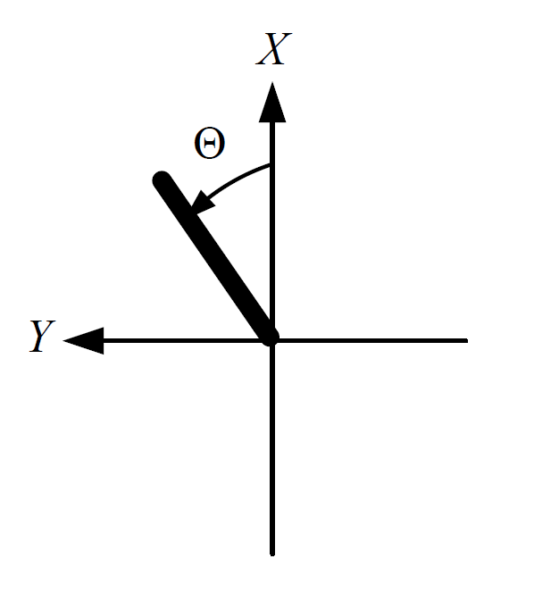
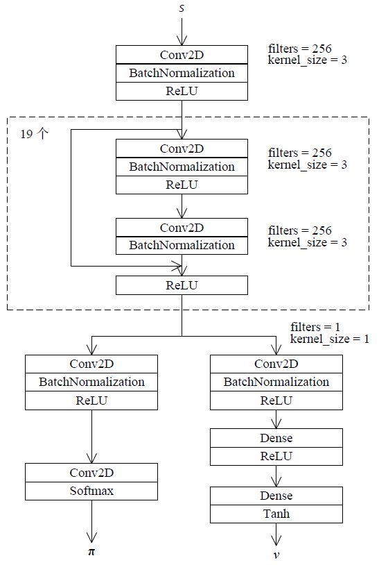

# 《强化学习：原理与Python实现》更新与勘误

（2019年11月第1版第2次印刷）

Gym 0.25版本更新了API，GitHub代码已相应更新。代码以GitHub上为准。

### 行数计算方法

本勘误文档中，行数计算“第$i$行”（$i=0,1,2,\ldots$）是从0开始计数的。小节标题、公式、内联代码、注意、本章要点记入行数，章标题、图、表、代码清单及它们的题注不计入行数。空行不计入行数。

$
\newcommand{\sfA}{\unicode{x1d608}}
\newcommand{\sfS}{\unicode{x1d61a}}
\newcommand{\sfa}{\unicode{x1d622}}
\newcommand{\sfs}{\unicode{x1d634}}
\newcommand{\bftheta}{\pmb{\unicode{x3B8}}}
\newcommand{\E}{\textrm{E}}
$

## 第11页第17行

动作空间是Disrete(3)

### 改为

动作空间是Discrete(3)


## 第17页第6行

作者注：
“轨道”又称为“轨迹”。本书中这两个词混用。


## 第20页第2行

作者注：
这种带折扣的回报定义既可以用于回合制任务，也可以用于连续性任务，是一种统一的表示。


## 第20页第9行

为$\bar{R}=\lim\limits_{t\to+\infty}\E\left[\frac{1}{t}\sum\limits_{\tau=0}^{t}R_\tau\right]$

### 改为

为$\bar{R}=\lim\limits_{t\to+\infty}\E\left[\frac{1}{t}\sum\limits_{\tau=1}^{t}R_\tau\right]$

## 第22页图2-2b)中图注

$v_\pi(\sfs)$

#### 改为

$v_\pi(\sfs')$

## 第24页代码清单2-1代码最后一行

```
        q_hungry_eat, q_hungry_none, q_full_eat, q_full_none)
```

### 代码改为

```
        q_hungry_none, q_hungry_eat, q_full_none, q_full_eat)
```

## 第28页第0行

$\Delta=\left(1-\gamma\right)\left(1-\left(1-\alpha{x}-\beta{y}\right)\right)>0$

改为

$\Delta=\left(1-\gamma\right)\left(1-\left(1-\alpha{x}-\beta{y}\right)\gamma\right)>0$


## 第28页第1行

分母部分

### 改为

分子部分

## 第29页正文第2行

$\gamma<\frac{1-4\beta}{1-\alpha}$

#### 改为

$\gamma\ge\frac{1-4\beta}{1-\alpha}$

## 第30页

作者注：用线性规划求解最优状态价值的详细证明可见《Markov Decision Processes: Discrete Stochastic Dynamic Programming》（Martin Puterman）的第6.9节。证明大致如下：当$c\left(\sfs\right)$为Markov决策过程的初始状态分布时，原问题和对偶问题的目标都是Markov决策过程的平均回合奖励，原问题的最优解是最优状态价值。对$c\left(\sfs\right)$做灵敏度分析可知，无论$c\left(\sfs\right)$取什么分布，对偶问题均有解（这利用到对偶问题的可行域就是带折扣的状态动作对组成的分布所在的空间），所以原问题的最优解都是不变的。也就是说，Markov决策过程的最优状态价值和初始状态分布无关。进一步，可以在原问题中放宽$\sum\nolimits_{\sfs}c\left(\sfs\right)=1$这个限制，原问题的解依然不变，只是优化目标进行了放缩。


## 第33页第6行

Bellmn期望方程为

### 改为

Bellman期望方程为

## 第33页第11行

Bellan期望方程：

### 改为

Bellman期望方程：


## 第33页代码清单2-6题注

用Bellman方差求解

### 改为

用Bellman方程求解


## 第34页第9行

计算这个动态规划问题

### 改为

计算这个线性规划问题

## 第39页第1行

$v_{*}\left(\sfs'\right)$

### 改为

$v\left(\sfs'\right)$

## 第39页第25行

（fix point）

### 改为

（fixed point）


## 第42页第9行

对于两个确定性的策略

### 改为

对于策略

## 第48页3.5节

作者注：Gym 0.19版本将FrozenLake-v0改为FrozenLake-v1。

作者注：Gym 0.22删除了DiscreteEnv类，所以env.unwrapped.nS和env.unwrapped.nA不再可用。建议用env.observation_space.n替换env.unwrapped.nA，用env.action_space.n替换env.unwrapped.nA。

## 第50页第4行

这个函数使用theta作

### 改为

这个函数使用tolerant作

## 第54页第15行

$\frac{1}{c}\sum\nolimits_{i=1}^c{g_c}$

### 改为

$\frac{1}{c}\sum\nolimits_{i=1}^c{g_i}$


## 第56页第10行

同时满足$\left\{\alpha_k:k=1,2,\ldots\right\}$

### 改为

$\left\{\alpha_k:k=1,2,\ldots\right\}$同时满足


## 第57页算法4-2第1步，第58页算法4-4第1步（共2处）

初始化动作价值估计

### 改为

初始化状态价值估计

## 第58页最后一行

态$\sfs_{起始}$

#### 改为

态$\sfs_{开始}$

## 第61页第4行

$q_{\pi'}\left(\sfs,\sfa\right)=\frac{\varepsilon}{\left|\mathcal{A}\left(\sfs\right)\right|}\sum\limits_\sfa{q_\pi\left(\sfs,\sfa\right)}+\left(1-\varepsilon\right)\mathop{\max}\limits_\sfa q_\pi\left(\sfs,\sfa\right)$

## 改为

$\sum\limits_{\sfa}{\pi'\left(\sfa|\sfs\right)q_\pi\left(\sfs,\sfa\right)}=\frac{\varepsilon}{\left|\mathcal{A}\left(\sfs\right)\right|}\sum\limits_\sfa{q_\pi\left(\sfs,\sfa\right)}+\left(1-\varepsilon\right)\mathop{\max}\limits_\sfa q_\pi\left(\sfs,\sfa\right)$


## 第61页算法4-6第2.3.3步

$\pi\left(\sfA^*|\sfS_t\right)\leftarrow\left(1-\varepsilon\right)$

### 改为

$\pi\left(\sfA^*|\sfS_t\right)\leftarrow\pi\left(\sfA^*|\sfS_t\right)+\left(1-\varepsilon\right)$


## 第64页第3行

$v\leftarrow{v}+\frac{1}{c}\left(g-v\right)$

### 改为

$v\leftarrow{v}+\frac{\rho}{c}\left(g-v\right)$


## 第64页第7行

$v\leftarrow{v}+\frac{\rho}{c}\left(\rho{g}-v\right)$

### 改为

$v\leftarrow{v}+\frac{1}{c}\left(\rho{g}-v\right)$


## 第64页算法4-7第2.4.2步

$w{\left[G-q\left(\sfS_t,\sfA_t\right)\right]^2}$


### 改为

$\rho{\left[G-q\left(\sfS_t,\sfA_t\right)\right]^2}$


## 第65页算法4-8第2.2步

$\sfS_0,\sfA_0,R_1,{\sfS_1},{\sfA_1},R_1,\ldots,\sfS_{T-1},\sfA_{T-1},R_T,\sfS_T$

### 改为

$\sfS_0,\sfA_0,R_1,{\sfS_1},{\sfA_1},R_2,\ldots,\sfS_{T-1},\sfA_{T-1},R_T,\sfS_T$

## 第66页4.3节

作者注：Gym 0.20版本将Blackjack-v0改为Blackjack-v1。

## 第67页第3行

范围为3~21的int型数值

### 改为

范围为4~21的int型数值


## 第67页第5行

是有将1张A牌计算为11点。

### 改为

是否将1张A牌计算为11点。

## 第71页第7行

最优价值和最优价值函数

### 改为

最优策略和最优价值函数

## 第72页4.3.4节正文第1行，第73页正文第0行

`evaluate_action_monte_carlo_importance_resample`

### 改为

`evaluate_monte_carlo_importance_sample`

## 第72页代码清单4-7第0行，第73页正文第7行

`evaluate_monte_carlo_importance_resample`

### 改为

`evaluate_monte_carlo_importance_sample`

## 第73页代码清单4-8第0行，第74页正文第0行，第74页正文第3行

`monte_carlo_importance_resample`

改为

`monte_carlo_importance_sample`

## 第75页第8行

$\rho_{t:T-1}=\prod\limits_{k=t}^{T-1}{\frac{{\pi\left(\sfA_t|\sfS_t\right)}}{{b\left(\sfA_t|\sfS_t\right)}}}$

### 改为

$\rho_{t:T-1}=\prod\limits_{\tau=t}^{T-1}{\frac{\pi\left(\sfA_\tau|\sfS_\tau\right)}{{b\left(\sfA_\tau|\sfS_\tau\right)}}}$


## 第79页算法5-2第2.1步

2.1（初始化状态动作对）

### 改为
2.1（初始化状态）

## 第81页算法5-4输出

输出：动作价值估计

### 改为

输出：状态价值估计

## 第85页算法5-10输入

输入：环境（无数学描述）、策略$\pi$。

#### 改为

输入：环境（无数学描述）、如果是策略评估还需要输入策略$\pi$。

## 第85页算法5-10输出

若是最优策略控制则还是输出策略

### 改为

若是最优策略控制则还要输出策略

## 第85页算法5-10第2.3.1步

根据$\pi\left(\cdot\mid\sfS_{t+n}\right)$决定

#### 改为

根据$b\left(\cdot\mid\sfS_{t+n}\right)$决定

## 第87页第14行

使得从$\sfs$<sub>状态</sub>更倾向于选择

### 改为

使得从$\sfs$<sub>开始</sub>更倾向于选择

## 第88页算法5-12第2.1步

2.1（初始化状态动作对）

### 改为

2.1（初始化状态）

## 第88页算法5-12第2.2.4步

$U\leftarrow{R}+\gamma{q^{\left(1-i\right)}}\left(\sfS_{t+1},\arg{\max_\sfa}{q^{\left(i\right)}}\left(\sfS_{t+1},\sfa\right)\right)$


### 改为

$U\leftarrow{R}+\gamma{q^{\left(1-i\right)}}\left(\sfS',\arg{\max_\sfa}{q^{\left(i\right)}}\left(\sfS',\sfa\right)\right)$


## 第90页第13行

对的单步自益结果

### 改为

的单步自益结果

## 第91页算法5-13参数部分、第92页算法5-14参数部分

参数：资格迹参数$\beta$、

#### 改为

参数：资格迹参数$\lambda$和$\beta$、


## 第91页算法5-13第2.3.5步

### 改为

2.3.5（更新价值）$q\left(\sfs,\sfa\right)\leftarrow{q}\left(\sfs,\sfa\right)+\alpha{e}\left(\sfs,\sfa\right)\left[U-q\left(\sfS,\sfA\right)\right],\sfs\in\mathcal{S},\sfa\in\mathcal{A}\left(\sfs\right)$;

## 第91页算法5-13第2.3.6步

退出2.2步

#### 改为

退出2.3步


## 第92页算法5-14第2.1-2.2步

2.1（初始化资格迹）$c\left(\sfs\right)\leftarrow{0},\sfs\in\mathcal{S}$。

2.2（初始化状态动作对）选择状态$\sfS$。

### 改为

2.1（初始化资格迹）$e\left(\sfs\right)\leftarrow{0},\sfs\in\mathcal{S}$。

2.2（初始化状态）选择状态$\sfS$。


## 第92页算法5-14第2.3.3步

$\sfs\in\mathcal{S},\sfa\in\mathcal{A}$

### 改为

$\sfs\in\mathcal{S}$


## 第92页算法5-14第2.3.5步

### 改为

2.2.5（更新价值）$v\left(\sfs\right)\leftarrow{v}\left(\sfs\right)+\alpha{e}\left(\sfs\right)\left[U-v\left(\sfS\right)\right],\sfs\in\mathcal{S}$。


## 第96页代码清单5-6第14行

```
        v = (self.q[next_state].sum() * self.epsilon + \
```

### 改为

```
        v = (self.q[next_state].mean() * self.epsilon + \
```

## 第98页第2行

`DoubleQLearnignAgent`类

### 改为

`DoubleQLearningAgent`类

## 第100页第12行

$U_t^{\left(i\right)}=R_{t+1}+\gamma{q}^{\left(i\right)}\left(\sfS_{t+1},\arg\max_\sfa q^{\left(1-i\right)}\left(\sfS_{t+1},\sfa\right)\right)$

### 改为

$U_t^{\left(i\right)}=R_{t+1}+\gamma{q}^{\left(1-i\right)}\left(\sfS_{t+1},\arg\max_\sfa q^{\left(i\right)}\left(\sfS_{t+1},\sfa\right)\right)$


## 第100页第16行

形式为$U_t=R_{t+1}+q\left(\sfS_{t+1},\sfA_{t+1}\right)$。


### 改为

形式为$U_t=R_{t+1}+\gamma{q}\left(\sfS_{t+1},\sfA_{t+1}\right)$。


## 第102页第12行

$\sum\nolimits_{t=0}^T{{\left[G_t-v\left(\sfS_t;\mathbf{w}\right)\right]}^2}$

### 改为

$\sum\nolimits_{t=0}^{T-1}{{\left[G_t-v\left(\sfS_t;\mathbf{w}\right)\right]}^2}$


## 第104页算法6-4第2.1步

2.1（初始化状态动作对）选择状态$\sfS$，再根据输入策略$\pi$选择动作$\sfA$。

### 改为

2.1（初始化状态）选择状态$\sfS$。


## 第104页算法6-4第2.2.3步、第106页算法6-6第2.3.3步（共2处）

删去此步


## 第104页算法6-4第2.2.4步、第106页算法6-6第2.3.4步（共2处）

如果是动作价值评估

### 改为

如果是状态价值评估


## 第104页算法6-4第2.2.5步，第106页算法6-6第2.3.6步（共2处）

（更新动作价值函数）

### 改为

（更新价值函数）

## 第105页算法6-5第2.1步

#### 增加

初始化资格迹$\mathbf{z}\leftarrow\mathbf{0}$


## 第106页算法6-6第2.1~2.2步

2.1（初始化资格迹）$\boldsymbol{z}\leftarrow{0}$。

2.2（初始化状态动作对）选择状态$\sfS$，再根据输入策略$\pi$选择动作$\sfA$。

### 改为

2.1（初始化资格迹）$\mathbf{z}\leftarrow\mathbf{0}$。

2.2（初始化状态）选择状态$\sfS$。


## 第109页算法6-7第2.2步

决定确定性策略

### 改为

决定策略

## 第111页算法6-8第2.1步、第113页算法6-9第2.1步（共2处）

2.1（初始化状态动作对）

### 改为

2.1（初始化状态）

## 第114页第5行

算法6-10

### 改为

算法6-9

## 第114页6.4.4节

本节将“duel network”译作“对偶网络”有误。可译为“决斗网络”。相应的“对偶Q网络”、“对偶深度Q网络”可改为“决斗Q网络”、“决斗深度Q网络”。


## 第118页

作者注：

砖瓦编码是一种历史悠久的特征构造方法，可用于回归、分类等问题。目前学术界倾向于用神经网络代替砖瓦编码来构造特征。由于砖瓦编码和强化学习没有直接关联，本书没有用过多的篇幅介绍砖瓦编码。

实际使用砖瓦编码时，不需要精确计算砖瓦的数量，常随意的大致估计砖瓦的数量作为特征数。如果设置的特征数大于真实的砖瓦数量，那么有些特征永远不会取到，有些浪费；如果设置的特征数小于真实的砖瓦数量，那么有多个砖瓦需要共享特征，具体逻辑可以见代码清单6-3中“冲突处理”部分。这些浪费和冲突往往不会造成明显的性能损失。

第118页砖瓦数计算：每个大网格的网格宽度刚好是整个取值范围的1/8。所以，第0层大网格每个维度有8个大网格；第1~7层由于有偏移，每个维度需要有9个大网格才能覆盖整个取值范围。第117页图6-3b的情况略有不同：这个图中每个维度的取值范围不是大网格的长度的整数倍。所以有些层偏移后，不需要更多的大网格也可以覆盖整个取值范围。


## 第126页第10行

再配合其他一些容易活动的

### 改为

再配合其他一些容易获得的


## 第126页最后一行

$=\sum\limits_\sfs\Pr\left[\sfS_t=\sfs\right]\nabla{v}_{\pi\left(\bftheta\right)}\left(\sfS_t\right)$

### 改为

$=\sum\limits_\sfs\Pr\left[\sfS_t=\sfs\right]\nabla{v}_{\pi\left(\bftheta\right)}\left(\sfs\right)$

## 第127页第10行

$=\E\left[\sum\limits_\sfa{q}_{\pi\left(\bftheta\right)}\left(\sfS_0,\sfa\right)\nabla\pi\left(\sfa|\sfS_0;\bftheta\right)\right]+\E\left[\sum\limits_\sfa\gamma{q}_{\pi\left(\bftheta\right)}\left(\sfS_1,\sfa\right)\nabla\pi\left(\sfa|\sfS_1;\bftheta\right)\right]+\gamma^2\E\left[\nabla{v}_{\pi\left(\bftheta\right)}\left(\sfS_1\right)\right]$

改为

$=\E\left[\sum\limits_\sfa{q}_{\pi\left(\bftheta\right)}\left(\sfS_0,\sfa\right)\nabla\pi\left(\sfa|\sfS_0;\bftheta\right)\right]+\E\left[\sum\limits_\sfa\gamma{q}_{\pi\left(\bftheta\right)}\left(\sfS_1,\sfa\right)\nabla\pi\left(\sfa|\sfS_1;\bftheta\right)\right]+\gamma^2\E\left[\nabla{v}_{\pi\left(\bftheta\right)}\left(\sfS_2\right)\right]$


## 第127页第18行

$=\E\left[\gamma^t{q}_{\pi\left(\bftheta\right)}\left(\sfS_t,\sfA_t\right)\nabla\pi\left(\sfA_t|\sfS_t;\bftheta\right)\right]$

### 改为

$=\E\left[\gamma^t{q}_{\pi\left(\bftheta\right)}\left(\sfS_t,\sfA_t\right)\nabla\ln\pi\left(\sfA_t|\sfS_t;\bftheta\right)\right]$


## 第127页第20行

$\E\left[\sum\limits_\sfa{\gamma^t}q_{\pi\left(\bftheta\right)}\left(\sfS_t,\sfa\right)\nabla\pi\left(\sfa|\sfS_t;\bftheta\right)\right]=\E\left[\gamma^t{q}_{\pi\left(\bftheta\right)}\left(\sfS_t,\sfA_t\right)\nabla\pi\left(\sfA_t|\sfS_t;\bftheta\right)\right]=\E\left[\gamma^t{G_t}\nabla\pi\left(\sfA_t|\sfS_t;\bftheta\right)\right]$

### 改为

$\E\left[\sum\limits_\sfa{\gamma^t}q_{\pi\left(\bftheta\right)}\left(\sfS_t,\sfa\right)\nabla\pi\left(\sfa|\sfS_t;\bftheta\right)\right]=\E\left[\gamma^t{q}_{\pi\left(\bftheta\right)}\left(\sfS_t,\sfA_t\right)\nabla\ln\pi\left(\sfA_t|\sfS_t;\bftheta\right)\right]=\E\left[\gamma^t{G_t}\nabla\ln\pi\left(\sfA_t|\sfS_t;\bftheta\right)\right]$


## 第128页第10行

增量$\alpha\gamma^tG_t\nabla\pi\left(\sfA_t|\sfS_t;\bftheta_t\right)$

#### 改为

增量$\alpha\gamma^tG_t\nabla\pi\left(\sfA_t|\sfS_t;\bftheta\right)$


## 第128页算法7-1输入和第130页算法7-2输入（共2处）

输入：环境（无数学描述）、策略$\pi$。

### 改为

输入：环境（无数学描述）。

## 第128页算法7-1第2步和第130页算法7-2第2步（共2处）

2.（时序差分更新）

### 改为

2.（回合更新）

## 第129页第10~12行

$=\sum\limits_\sfa{\gamma^t\left(G_t-B\left(\sfS_t\right)\right)\nabla\pi\left(\sfA_t|\sfS_t;\bftheta\right)}$

$=\sum\limits_\sfa{\gamma^tG_t\nabla\pi\left(\sfa|\sfS_t;\bftheta\right)}$

$=\text{E}\left[\gamma^tG_t\nabla\pi\left(\sfa|\sfS_t;\bftheta\right)\right]$

### 改为

$=\sum\limits_\sfa{\gamma^t\left(G_t-B\left(\sfS_t\right)\right)\nabla\pi\left(\sfa|\sfS_t;\bftheta\right)}$

$=\sum\limits_\sfa{\gamma^tG_t\nabla\pi\left(\sfa|\sfS_t;\bftheta\right)}$

$=\text{E}\left[\gamma^tG_t\nabla\pi\left(\sfA_t|\sfS_t;\bftheta\right)\right]$


### 第129页第15行

随机变量$B\left(\sfS\right)=-\sum\limits_{\tau=1}^{t-1}\gamma^{\tau-t}R_\tau$，

### 改为

随机变量$B\left(\sfS\right)=-\sum\limits_{\tau=0}^{t-1}\gamma^{\tau-t}R_{\tau+1}$，


## 第130页算法7-2第2.3.3步

更新$\bftheta$以减小$-\gamma^t\left[G-v\left(\sfS_t;\mathbf{w}\right)\right]\nabla\ln\pi\left(\sfA_t|\sfS_t;\bftheta\right)$


## 改为

更新$\bftheta$以减小$-\gamma^t\left[G-v\left(\sfS_t;\mathbf{w}\right)\right]\ln\pi\left(\sfA_t|\sfS_t;\bftheta\right)$

## 第131页算法7-3第2.3步

2.3（初始化回报和权重）

#### 改为

2.3（初始化回报）


## 第137页代码清单7-1中`learn()`函数

```
            y = np.eye(self.action_n)[df['action']] * \
                    df['psi'].values[:, np.newaxis]
            self.policy_net.fit(x, y, verbose=0)
```

#### 改为

```
            sample_weight = df['psi'].values[:, np.newaxis]
            y = np.eye(self.action_n)[df['action']]
            self.policy_net.fit(x, y, sample_weight=sample_weight, verbose=0)
```


## 第139页第17行

减了基线$b\left(\sfs\right)=v_\pi\left(\sfs\right)$

### 改为

减去基线$B\left(\sfs\right)=v_\pi\left(\sfs\right)$


## 第139页第18行

加上基线$b\left(\sfs\right)=v_\pi\left(\sfs\right)$

### 改为

减去基线$B\left(\sfs\right)=v_\pi\left(\sfs\right)$

## 第140页第4行

$R_{t+1}+v_\pi\left(\sfS_{t+1};\mathbf{w}\right)$

### 改为

$R_{t+1}+\gamma{v_\pi}\left(\sfS_{t+1};\mathbf{w}\right)$


## 第140页算法8-1第2.3.1步

得到采样$R$和

### 改为

得到奖励$R$和


## 第142页算法8.3第2.3.2步

作者注：这里的更新式子遵循了论文原文而没有考虑累积折扣。推导出现折扣是正确的；更新时考虑折扣也是正确和合理的。

## 第143页第5行，第143页算法8.4第2.3.4步（共2处）

$\nabla\ln\pi\left(\sfA\mid\sfS;\mathbf{w}\right)$

改为

$\nabla\ln\pi\left(\sfA\mid\sfS;\bftheta\right)$


## 第144页第7~11行

$\E_{\pi\left(\bftheta\right)}\left[\sum\limits_{t=0}^{+\infty}{\gamma^t{a_{\pi_k}}\left(\sfS_t,\sfA_t\right)} \right]$

$=\E_{\pi\left(\bftheta\right)}\left[\sum\limits_{t=0}^{+\infty}{\gamma^t\left(R_t+\gamma{v_{\pi\left(\bftheta_k\right)}}\left(\sfS_{t+1}\right)-{v_{\pi\left(\bftheta_k\right)}}\left(\sfS_t\right)\right)}\right]$

$=\E_{\pi\left(\bftheta\right)}\left[-{v_{\pi\left(\bftheta_k\right)}}\left(\sfS_0\right)+\sum\limits_{t=0}^{+\infty}{\gamma^tR_t}\right]$

$=-\E_{\sfS_0}\left[v_{\pi\left(\bftheta_k\right)}\left(\sfS_0\right)\right]+\E_{\pi\left(\bftheta\right)}\left[\sum\limits_{t=0}^{+\infty}{\gamma^t{R_t}}\right]$

$=-\E_{\pi\left(\bftheta_k\right)}\left[G_0\right]+\E_{\pi\left(\bftheta\right)}\left[G_0\right].$

### 改为

$\E_{\pi\left(\bftheta\right)}\left[\sum\limits_{t=0}^{+\infty}{\gamma^{t}a_{\pi\left(\bftheta_k\right)}\left(\sfS_t,\sfA_t\right)}\right]$

$=\E_{\pi\left(\bftheta\right)}\left[\sum\limits_{t=0}^{+\infty}{\gamma^t\left(R_{t+1}+\gamma{v_{\pi\left(\bftheta_k\right)}}\left(\sfS_{t+1}\right)-{v_{\pi\left(\bftheta_k\right)}}\left(\sfS_t\right)\right)}\right]$

$=\E_{\pi\left(\bftheta\right)}\left[-v_{\pi\left(\bftheta_k\right)}\left(\sfS_0\right)+\sum\limits_{t=0}^{+\infty}{\gamma^tR_{t+1}}\right]$

$=-\E_{\sfS_0}\left[v_{\pi\left(\bftheta_k\right)}\left(\sfS_0\right)\right]+\E_{\pi\left(\bftheta\right)}\left[\sum\limits_{t=0}^{+\infty}{\gamma^tR_{t+1}}\right]$

$=-\E_{\pi\left(\bftheta_k\right)}\left[G_0\right]+\E_{\pi\left(\bftheta\right)}\left[G_0\right].$

## 第144页第15行和第18行（共2处）

$\E_{\sfS_t,\sfA_t\sim\pi\left(\bftheta\right)}\left[a_{\pi_k}\left(\sfS_t,\sfA_t\right)\right]$

#### 改为

$\E_{\sfS_t,\sfA_t\sim\pi\left(\bftheta\right)}\left[a_{\pi_{\left(\bftheta_k\right)}}\left(\sfS_t,\sfA_t\right)\right]$


## 第146页算法8-5第2.3步

更新$\bftheta$以减小

### 改为

更新$\bftheta$以增大


## 第147页图8-1中间线的注记

$l_{\left(\bftheta\right)}$

### 改为

$l\left(\bftheta\right)$


## 第148页第8行

J. Kakade在文章《Anatural policy gradient》

### 改为

S. Kakade在文章《A natural policy gradient》


## 第149页第9行

如果它们满足$\mathbf{p}_i\mathbf{F}\mathbf{p}_j=\mathbf{0}$

### 改为

如果它们满足$\mathbf{p}_i^\text{T}\mathbf{F}\mathbf{p}_j=0$


## 第150页第9行

$\frac{\partial}{\partial\alpha_k}\left(\frac{1}{2}{{\left(\mathbf{x}_k+\alpha_k\mathbf{p}_k\right)}^\mathrm{T}}\mathbf{F}\left(\mathbf{x}_k+\alpha_k\mathbf{p}_k\right)-\mathbf{g}^{\mathrm{T}}\left(\mathbf{x}_k+\alpha\mathbf{p}_k\right)\right)=\alpha_k\mathbf{p}_k^\mathrm{T}\mathbf{F}\mathbf{p}_k-\mathbf{p}_k^\mathrm{T}\left(\mathbf{F}\mathbf{x}_k-\mathbf{g}\right)$

### 改为

$\frac{\partial}{\partial\alpha_k}\left(\frac{1}{2}{{\left(\mathbf{x}_k+\alpha_k\mathbf{p}_k\right)}^\mathrm{T}}\mathbf{F}\left(\mathbf{x}_k+\alpha_k\mathbf{p}_k\right)-\mathbf{g}^{\mathrm{T}}\left(\mathbf{x}_k+\alpha_k\mathbf{p}_k\right)\right)=\alpha_k\mathbf{p}_k^\mathrm{T}\mathbf{F}\mathbf{p}_k+\mathbf{p}_k^\mathrm{T}\left(\mathbf{F}\mathbf{x}_k-\mathbf{g}\right)$


## 第150页第11行

$\alpha_k=\frac{\mathbf{p}_k^\mathrm{T}\left(\mathbf{F}\mathbf{x}_k-\mathbf{g}\right)}{\mathbf{p}_k^\mathrm{T}\mathbf{F}\mathbf{p}_k}$

### 改为

$\alpha_k=\frac{\mathbf{p}_k^\mathrm{T}\left(\mathbf{g}-\mathbf{F}\mathbf{x}_k\right)}{\mathbf{p}_k^\mathrm{T}\mathbf{F}\mathbf{p}_k}$


## 第150页算法8-7第2.1步

2.1  $\mathbf{z}\leftarrow\mathbf{Fx}$

### 改为

2.1  $\mathbf{z}\leftarrow\mathbf{Fp}$


## 第154页算法8-10第2.2步

2.2（决定初始动作）用$b\left(\cdot|\sfS\right)$得到动作$\sfA$；

### 改为

2.2（决定初始状态动作对）选择状态$\sfS$，用$b\left(\cdot|\sfS\right)$得到动作$\sfA$；


## 第155页第28行

$=-\sum\limits_\sfa{\frac{\pi\left(\sfa|\sfS_t;\bftheta^\mathrm{EMA}\right)}{\pi\left(\sfa|\sfS_t;\bftheta\right)}}.$

### 改为

$=-\sum\limits_\sfa{\frac{\pi\left(\sfa|\sfS_t;\bftheta^\mathrm{EMA}\right)}{\pi\left(\sfa|\sfS_t;\bftheta\right)}\nabla_{\bftheta}\pi\left(\sfa|\sfS_t;\bftheta\right)}.$


## 第157页算法8-11第3.2.3步

$\mathbf{k}\leftarrow{\nabla_{\bftheta}} {d_\textrm{KL}}\left(\pi\left(\cdot|\sfS_t;\bftheta^\mathrm{EMA}\right)||\pi\left(\cdot|\sfS_t;\bftheta\right)\right)$

### 改为

$\mathbf{k}\leftarrow{\nabla_{\bftheta}} {d_\textrm{KL}}\left(\pi\left(\cdot|\sfS_t;\bftheta^\mathrm{EMA}\right)||\pi\left(\cdot|\sfS_t;\bftheta'\right)\right)$

### 第161页第4~5行

作者注：“动作价值网络和策略网络往往采用矢量形式的输出”指的是动作空间是离散动作空间的情况。如果动作空间是连续动作空间，往往用Gaussian形式的策略，详见GitHub代码。包括SAC算法在内的使用策略梯度的算法采用Gaussian形式策略后，策略被限制为了单峰（unimodal）形式。如果需要策略具有多峰（multimodal）形式，可以使用混合Gaussian模型（Gaussian Mixture Model，GMM）。

## 第161页8.6节

作者注：这个案例的动作空间是离散的。同时，本章介绍的算法，包括但不限于PPO、SAC等算法，也可用于动作空间是连续空间的情况。


## 第162页第11~12行

使得角速度有界$\dot\Theta_t\in\left[-4\pi,4\pi\right]$，$\dot\Theta_t\in\left[-9\pi,9\pi\right]$。

### 改为

使得角速度有界$\dot\Theta'_t\in\left[-4\pi,4\pi\right]$，$\dot\Theta''_t\in\left[-9\pi,9\pi\right]$。


## 第162页第17行

单5-7中的

### 改为

单5-3中的


## 第163页代码清单8-1

其中的`learn()`函数代码应排版为（内容不变，只是重新排版）

```
def learn(self, observation, action, reward, next_observation, done,
        next_action=None):
    # 训练执行者网络
    x = observation[np.newaxis]
    u = self.critic_net.predict(x)
    q = u[0, action]
    x_tensor = tf.convert_to_tensor(x, dtype=tf.float32)
    with tf.GradientTape() as tape:
        pi_tensor = self.actor_net(x_tensor)[0, action]
        logpi_tensor = tf.math.log(tf.clip_by_value(pi_tensor,
                1e-6, 1.))
        loss_tensor = -self.discount * q * logpi_tensor
    grad_tensors = tape.gradient(loss_tensor, self.actor_net.variables)
    self.actor_net.optimizer.apply_gradients(zip(
            grad_tensors, self.actor_net.variables))
    
    # 训练评论者网络
    u[0, action] = reward
    if not done:
        q = self.critic_net.predict(
                next_observation[np.newaxis])[0, next_action]
        u[0, action] += self.gamma * q
    self.critic_net.fit(x, u, verbose=0)
    
    if done:
        self.discount = 1.
    else:
        self.discount *= self.gamma
```


## 第165页代码清单8-2前4行（中间有个空行不计入）

多缩进4个空格


## 第173页第9行

$\nabla{v}_{\pi\left(\bftheta\right)}\left(\sfS_t\right)$

### 改为

$\nabla{v}_{\pi\left(\bftheta\right)}\left(\sfs\right)$


## 第173页第20行

$=\E\left[\nabla\pi\left(\sfS_0;\bftheta\right){\left[\nabla_\sfa q_{\pi\left(\bftheta\right)}\left(\sfS_0,\sfa\right)\right]}_{\sfa=\pi\left(\sfS_0;\bftheta\right)}\right]+\gamma\E\left[\nabla\pi\left(\sfS_1;\bftheta\right){\left[{\nabla_\sfa}{q_{\pi\left(\bftheta\right)}}\left(\sfS_1,\sfa\right)\right]}_{\sfa=\pi\left(\sfS_1;\bftheta\right)}\right]+\gamma^2\E\left[\nabla{v}_{\pi\left(\bftheta\right)}\left(\sfS_1\right)\right]$

### 改为

$=\E\left[\nabla\pi\left(\sfS_0;\bftheta\right){\left[\nabla_\sfa q_{\pi\left(\bftheta\right)}\left(\sfS_0,\sfa\right)\right]}_{\sfa=\pi\left(\sfS_0;\bftheta\right)}\right]+\gamma\E\left[\nabla\pi\left(\sfS_1;\bftheta\right){{\left[{\nabla_\sfa}{q_{\pi\left(\bftheta\right)}}\left(\sfS_1,\sfa\right)\right]}_{\sfa=\pi\left(\sfS_1;\bftheta\right)}}\right]+\gamma^2\E\left[\nabla{v}_{\pi\left(\bftheta\right)}\left(\sfS_2\right)\right]$


## 第174页第4行

$\rho_\pi\left(\sfs\right)=\int\limits_{\sfs_0\in\mathcal{S}}p_{\sfS_0}\left(\sfs_0\right)\sum\limits_{t=0}^{+\infty}\gamma_t\Pr\left[\sfS_t|\sfS_0=\sfs_0;\bftheta\right]\mathrm{d}\sfs_0$

#### 改为

$\rho_{\pi\left(\bftheta\right)}\left(\sfs\right)=\sum\limits_{t=0}^{+\infty}\gamma_t\Pr\left[\sfS_t=\sfs;\pi\left(\bftheta\right)\right]$, $\sfs\in\mathcal{S}$

作者注：从严格意义上说，有折扣的状态分布并不是概率分布，因为它的和不总是1。针对有折扣的状态分布的期望也只是采用了期望的形式。


## 第174页第7~11行

$=\sum\limits_{t=0}^{+\infty}\int\limits_{\sfs}p_{\sfS_t}\left(\sfs\right)\gamma^t\nabla\pi\left(\sfs;\bftheta\right)\left[\nabla_\sfs{q}_{\pi\left(\bftheta\right)}\left(\sfs,\sfa\right)\right]_{\sfa=\pi\left(\sfS_t;\bftheta\right)}\mathrm{d}\sfs$

$=\sum\limits_{t=0}^{+\infty}\int\limits_{\sfs}\left(\int_{\sfs_0}\int\limits_{\sfs_0}p_{\sfS_0}\left(\sfs_0\right)\Pr\left[\sfS_t=\sfs|\sfs_0=\sfs_0;\bftheta\right]\mathrm{d}\sfs_0\right)\gamma^t\nabla\pi\left(\sfs;\bftheta\right)\left[\nabla_\sfs{q}_{\pi\left(\bftheta\right)}\left(\sfs,\sfa\right)\right]_{\sfa=\pi\left(\sfs;\bftheta\right)}\mathrm{d}\sfs$

$=\int\limits_{\sfs}\left(\int\limits_{\sfs_0}p_{\sfS_0}\left(\sfs_0\right)\sum\limits_{t=0}^{+\infty}\gamma^t\Pr\left[\sfS_t=\sfs|\sfs_0=\sfs_0;\bftheta\right]\mathrm{d}\sfs_0\right)\nabla\pi\left(\sfS_t;\bftheta\right)\left[\nabla_\sfa{q}_{\pi\left(\bftheta\right)}\right]_{\sfa=\pi\left(\sfs;\bftheta\right)}\mathrm{d}\sfs$

$=\int\limits_{\sfs}\rho_{\pi\left(\bftheta\right)}\left(\sfs\right)\nabla\pi\left(\sfs;\bftheta\right)\left[\nabla_\sfa{q}_{\pi\left(\bftheta\right)}\left(\sfs,\sfa\right)\right]_{\sfa=\pi\left(\sfs;\bftheta\right)}\mathrm{d}\sfs$

$=\E_{\rho_{\pi\left(\bftheta\right)}}\left[\nabla\pi\left(\sfs;\bftheta\right)\left[\nabla_\sfa{q}_{\pi\left(\bftheta\right)}\left(\sfs,\sfa\right)\right]_{\sfa=\pi\left(\sfs;\bftheta\right)}\right]$

#### 改为

$=\sum\limits_{t=0}^{+\infty}\sum\limits_{\sfs}^{}\Pr\left[\sfS_t=\sfs;\pi\left(\bftheta\right)\right]\gamma^t\nabla\pi\left(\sfs;\bftheta\right)\left[\nabla_\sfa{q}_{\pi\left(\bftheta\right)}\left(\sfs,\sfa\right)\right]_{\sfa=\pi\left(\sfs;\bftheta\right)}$

$=\sum\limits_{\sfs}^{}\left(\sum\limits_{t=0}^{+\infty}\gamma^t\Pr\left[\sfS_t=\sfs;\pi\left(\bftheta\right)\right]\right)\nabla\pi\left(\sfs;\bftheta\right)\left[\nabla_\sfa{q}_{\pi\left(\bftheta\right)}\left(\sfs,\sfa\right)\right]_{\sfa=\pi\left(\sfs;\bftheta\right)}$

$=\sum\limits_{\sfs}^{}\rho_{\pi\left(\bftheta\right)}\left(\sfs\right)\nabla\pi\left(\sfs;\bftheta\right)\left[\nabla_\sfa{q}_{\pi\left(\bftheta\right)}\right]_{\sfa=\pi\left(\sfs;\bftheta\right)}$

$=\E_{\rho_{\pi\left(\bftheta\right)}}\left[\nabla\pi\left(\sfS;\bftheta\right)\left[\nabla_\sfa{q}_{\pi\left(\bftheta\right)}\left(\sfS,\sfa\right)\right]_{\sfa=\pi\left(\sfS;\bftheta\right)}\right]$


## 第175页第7行

其中$\sfA_\min$和$\sfA_\max$是动作的最小取值和最大取值

### 改为

其中$\sfA_\text{low}$和$\sfA_\text{high}$是动作的最小取值和最大取值


## 第175页算法9-1第2.2步

2.2（决定初始动作）

### 改为

2.2（初始化状态动作对）选择状态$\sfS$，


## 第176页第12行

$\sigma^2e^{-\theta\left(t+s\right)}\E\left[\int_{0}^{t}e^{\theta\tau}\mathrm{d}B_t\int_{0}^{s}e^{\theta\tau}\mathrm{d}B_t\right]$

#### 改为

$\sigma^2e^{-\theta\left(t+s\right)}\E\left[\int_{0}^{t}e^{\theta\tau}\mathrm{d}B_\tau\int_{0}^{s}e^{\theta\tau}\mathrm{d}B_\tau\right]$


## 第176页到第177页9.2节正文

### 改为

对于连续的动作空间，我们希望能够找到一个确定性策略，使得每条轨迹的回报最大。同策确定性算法利用策略$\pi\left(\bftheta\right)$生成轨迹，并在这些轨迹上求得回报的平均值，通过让平均回报最大，使得每条轨迹上的回报尽可能大。事实上，如果每条轨迹的回报都要最大，那么对于任意策略$b$采样得到的轨迹，我们都希望在这套轨迹上的平均回报最大。所以异策确定性策略算法引入确定性行为策略$b$，将这个平均改为针对策略$b$采样得到的轨迹，得到异策确定性梯度为$\nabla\E_{\rho_b}\left[q_{\pi\left(\bftheta\right)}\left(\sfS,\pi\left(\sfS;\bftheta\right)\right)\right]=\E_{\rho_b}\left[\nabla\pi\left(\sfS;\bftheta\right)\left[\nabla_a{q}_{\pi\left(\bftheta\right)}\left(\sfS,\sfa\right)\right]_{\sfa=\pi\left(\sfS;\bftheta\right)}\right]$。这个表达式与同策的情形相比，期望运算针对的表达式相同。所以，异策确定性算法的迭代式与同策确定性算法的迭代式相同。

异策确定性算法可能比同策确定性算法性能好的原因在于，行为策略可能会促进探索，用行为策略采样得到的轨迹能够更加全面的探索轨迹空间。这时候，最大化对轨迹分布的平均期望时能够同时考虑到更多不同的轨迹，使得在整个轨迹空间上的所有轨迹的回报会更大。

与非确定性策略梯度相比，非确定性异策算法的迭代式中含有重采样因子$\frac{\pi\left(\sfA_t|\sfS_t;\bftheta\right)}{b\left(\sfA_t|\sfS_t\right)}$，而确定性异策算法中没有。这是因为，确定性的行为策略$b$并不对于确定性的目标策略$\pi\left(\bftheta\right)$绝对连续，重采样因子没有定义，所以不包括重采样因子。

## 第177页算法9-2第2.1步和2.2步之间

### 增加

2.2（初始化状态）选择状态$\sfS$；

2.3（确定行为策略）确定行为策略$b$；

## 第177页算法9-2第2.2.1步

2.2.1（执行）用$b(\cdot\mid\sfS)$得到

### 改为

2.4.1（执行）用$b(\sfS)$得到

## 第180页9.3节

作者注：Gym 0.21版本将Pendulum-v0改为Pendulum-v1。


## 第180页图9-1

### 改为




## 第180页第4行

$X$轴是水平向下的，$Y$轴是水平向右的。

### 改为

$X$轴是水平向上的，$Y$轴是水平向左的。


## 第180页表9-1最右边一列

| 倒立摆（Pendulum-v0）|
|----------|
| $\left[-\pi,\pi\right)\times\left[-4\pi,4\pi\right]\times\left[-9\pi,9\pi\right]$ |
| ${\left[-1,1\right]}^2\times\left[-4\pi,4\pi\right]\times\left[-9\pi,9\pi\right]$ |
| $\left[-2,2\right]$ |
| $\left[-\pi^2-6.404,0\right]$ |

### 改为

| 倒立摆（Pendulum-v0）|
|----------|
| $\left[-\pi,\pi\right)\times\left[-8,8\right]$ |
| ${\left[-1,1\right]}^2\times\left[-8,8\right]$ |
| $\left[-2,2\right]$ |
| $\left[-\pi^2-6.404,0\right]$ |


## 第180页第18-19行

$\Theta_{t+1}\leftarrow\Theta_t+0.05\left(\dot\Theta_t-0.75\sin\Theta_t-0.15\sfA_t\right)$在$\left[-\pi,+\pi\right)$的主值区间

$\dot\Theta_{t+1}\leftarrow\text{clip}\left(\dot\Theta_t-0.75\sin\Theta_t-0.15\sfA_t,-8,+8\right)$

### 改为

$\Theta_{t+1}\leftarrow{\Theta_t}+0.05\left(\dot\Theta_t+0.75\sin{\Theta_t}+0.15\sfA_t\right)$在$\left[-\pi,+\pi\right)$的主值区间

$\dot\Theta_{t+1}\leftarrow\text{clip}\left(\dot\Theta_t+0.75\sin{\Theta_t}+0.15\sfA_t,-8,+8\right)$

## 第188页10.1节

作者注：Gym 0.21版本修改了Atari游戏环境的安装方式。

## 第189页

适用于Python 3.7的下列安装文件

```
pip install Box2D-2.3.2-cp37-cp37m-win_amd64.whl
```

对应适用于Python 3.8的安装文件名为
```
pip install Box2D-2.3.2-cp38-cp38m-win_amd64.whl
```

对应Python 3.9和Python 3.10版本的以此类推。

## 第191页表10-1（共4处）

NoFrameSkip

### 改为

NoFrameskip


## 第207页图11-3

### 改为

